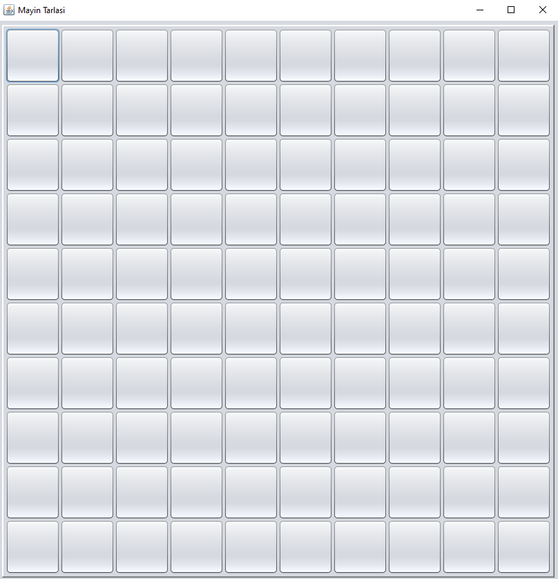
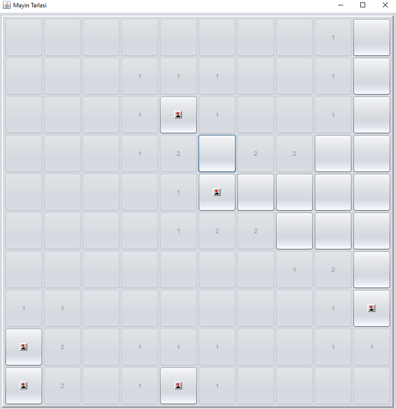
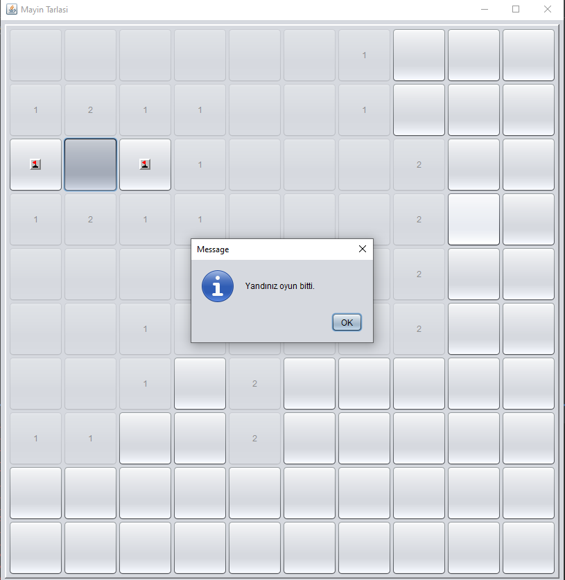
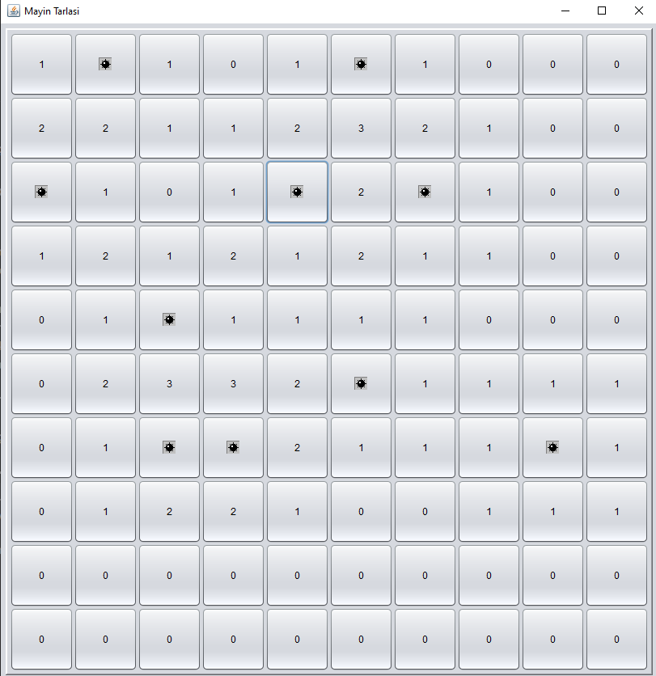

# Mayın Tarlası Oyunu (Java & Swing)

Bu proje, klasikleşmiş masaüstü Mayın Tarlası oyununun Java ve Swing kütüphanesi kullanılarak geliştirilmiş bir versiyonudur. Projenin temel amacı, oyunun temel mantığını (mayınların yerleştirilmesi, komşu mayın sayılarının hesaplanması, oyun kazanma/kaybetme durumları) ve kullanıcı arayüzünün (GUI) Swing ile entegrasyonunu başarılı bir şekilde gerçekleştirmektir.

## Ekran Görüntüleri

Oyunun farklı aşamalarından bazı görünümler:

**1. Oyun Başlangıcı (Boş Tahta):**

*Oyunun ilk açıldığındaki boş ve tıklanmaya hazır tahta görünümü.*

**2. Oyun İlerleyişi (Açılmış Hücreler ve Mayınlar):**

*Oyun sırasında açılmış hücreler, komşu mayın sayıları ve (oyun sonunda) ortaya çıkan mayınlar.*

**3. Oyun Sonu (Mayına Basıldığında):**

*Bir mayına tıklandığında çıkan "Yandınız oyun bitti." mesajı.*

**4. Oyun Sonu (Tüm Mayınların Gösterilmesi):**

*Oyun kaybedildiğinde veya kazanıldığında tüm mayınların tahta üzerinde gösterildiği durum.*

## Özellikler

*   **Klasik Oyun Mekanikleri:** Geleneksel Mayın Tarlası kurallarına uygun oyun akışı.
*   **Dinamik Tahta Oluşturma:** Belirlenen boyutlarda (bu örnekte 10x10) oyun tahtasının dinamik olarak oluşturulması.
*   **Rastgele Mayın Yerleşimi:** Oyun her başladığında mayınların rastgele konumlara yerleştirilmesi.
*   **Komşu Mayın Sayısı:** Açılan her hücrede, etrafındaki komşu mayın sayısının gösterilmesi.
*   **Boş Alanların Otomatik Açılması:** Komşusunda mayın olmayan bir hücreye tıklandığında, bağlantılı tüm boş hücrelerin otomatik olarak açılması (flood fill algoritması).
*   **Oyun Durumları:**
    *   Mayına tıklandığında oyunun kaybedilmesi.
    *   Mayın olmayan tüm hücreler açıldığında oyunun kazanılması.
*   **Basit ve Anlaşılır Arayüz:** Swing bileşenleri kullanılarak oluşturulmuş kullanıcı dostu bir arayüz.

## Kullanılan Teknolojiler

*   **Java:** Oyunun temel mantığı ve programlama dili.
*   **Swing (Java GUI Toolkit):** Kullanıcı arayüzünün (pencere, butonlar, olay yönetimi vb.) oluşturulması ve yönetilmesi için kullanıldı.

## Proje Yapısı ve Öğrenimler

Bu projede üzerinde durulan temel konular şunlardır:

*   **Oyun Mantığı Geliştirme:**
    *   İki boyutlu diziler (matris) kullanarak oyun tahtasının modellenmesi.
    *   Mayınların rastgele dağıtılması algoritması.
    *   Her bir hücre için komşu mayın sayısını hesaplama algoritması.
    *   Recursive (özyinelemeli) fonksiyonlar kullanılarak boş alanların otomatik açılması (flood fill).
    *   Oyunun kazanma ve kaybetme koşullarının belirlenmesi.
*   **GUI Entegrasyonu (Swing):**
    *   `JFrame` kullanarak ana oyun penceresinin oluşturulması.
    *   `JPanel` ve layout yöneticileri (örn: `GridLayout`) ile hücrelerin düzenli bir şekilde yerleştirilmesi.
    *   Hücreleri temsil etmek için `JButton` bileşenlerinin kullanılması.
    *   `ActionListener` arayüzü ile kullanıcı tıklamalarına tepki verilmesi ve oyun mantığının tetiklenmesi.
    *   `JOptionPane` ile oyun sonu mesajlarının gösterilmesi.
*   **Nesne Yönelimli Programlama (OOP) Kavramları:**
    *   Oyun tahtası, hücreler gibi oyun elemanlarını temsil eden sınıflar oluşturularak problem daha modüler bir şekilde çözülmeye çalışıldı. (Örneğin, her bir `JButton` aynı zamanda bir hücrenin durumunu (mayınlı mı, açık mı, bayraklı mı, komşu mayın sayısı vb.) temsil edebilir veya ayrı bir `Cell` sınıfı bu bilgileri tutabilir.)
    *   Kapsülleme (Encapsulation) ile hücrelerin iç durumlarının korunması ve kontrollü erişim sağlanması.

## Kurulum ve Çalıştırma

Projeyi yerel makinenizde çalıştırmak için:

1.  Bu repoyu klonlayın:
    ```bash
    git clone https://github.com/ZaifAhmet/Minesweeper.git
    ```
2.  Proje dizinine gidin:
    ```bash
    cd Minesweeper/src/minesweeper
    ```
3.  Java Development Kit (JDK) 8 veya üzeri bir sürümün kurulu olduğundan emin olun.
4.  Oyunun ana sınıfını (`.java` dosyasını) derleyin ve çalıştırın:
        ```bash
        javac HomePage.java
        java HomePage
        ```
    
